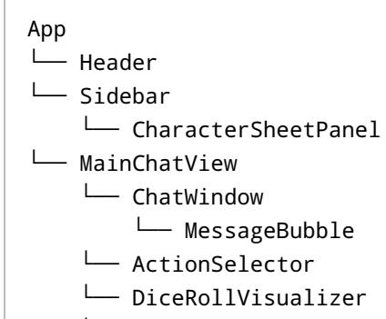

**Frontend Design Guidance Document: Love & Dice RPG Interface**

## **Project Overview**

The frontend will serve as the player-facing interface for the "Love & Dice" RPG experience. It will facilitate character creation, in-game dialogue and interactions, dice rolls, and AI-generated imagery. This is a singlepage application designed for immersion, interactivity, and responsiveness.

## **Recommended Technologies**

#### **Primary Framework:**

- **SvelteKit** •
- Lightweight and fast •
- Built-in reactivity •
- Good choice for a game-like SPA •
- SEO-friendly and SSR-capable •

**Alternative:** - **React with ShadCN/UI + TailwindCSS** - Mature ecosystem - Great styling with Tailwind and modern UI kit - Rich component library

**Recommendation:** Start with **React + ShadCN/UI + TailwindCSS** for prototyping and possible future expansion with Next.js.

# **UI/UX Design Goals**

## **Visual Tone**

- A modern blend of romance and fantasy RPG aesthetics •
- Use soft color palettes (rose, lilac, teal, ivory) •
- Rounded corners, shadowed cards, chat bubbles •

### **Layout**

- **Left Pane**: Character sheet & stats •
- **Main Panel**: Chat-based interface •
- **Modal Popups**: Character creation, dice rolls, image previews •

### **Components**

- ChatWindow: Displays roleplay dialogue between player & NPC •
- DiceRollVisualizer: Shows animated d100 rolls •
- CharacterSheetPanel: Toggleable sidebar showing stats •
- ImagePreviewModal: Displays AI-generated images •
- ActionSelector: Lets players choose tone (flirty, serious, etc.) •
- NotificationToaster: Shows AP gain/loss, success/failure •

# **Functional Requirements**

#### **Core Features**

- Character creation form •
- Chat interface with AI responses •
- Dice rolling mechanic with animation •
- Image generation trigger + display •
- Persistent session state (localStorage or backend cache) •

### **Optional Extras**

- Theme switcher (dark/light mode) •
- Role selector (Player/GM mode toggle) •
- Session log/export •

## **Component-State Diagram**

- └── ImagePreviewModal
- └── NotificationToaster

# **✏ Dev Notes**

- Modular folder structure for scalability •
- Use Tailwind utility classes for speed •
- Central context for session/player state •
- Fetch API abstraction layer for backend integration •

## **Next Steps**

- Scaffold the frontend structure with stub components 1.
- Build chat + dice UI 2.
- Connect to backend API 3.
- Iterate on polish with AI outputs and user testing 4.